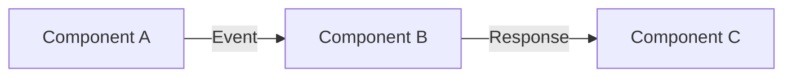

# AGENTS.md

AI coding assistant context for HyperFleet Architecture repository.

---

## 🎯 For Claude Code Users

**This file exists for [agentsmd.net](https://agentsmd.net/) compliance.**

Your primary context is **[CLAUDE.md](CLAUDE.md)** (auto-loaded).

Claude Code also auto-loads:
- `hyperfleet/standards/CLAUDE.md` — Standards document conventions
- `hyperfleet/components/CLAUDE.md` — Component design requirements

**Read CLAUDE.md for complete repository guidelines.**

---

## 🚨 Critical Warnings

⚠️ **This is a documentation-only repository**
```
No application code
No build scripts
No Dockerfiles
```

**Why?** This is the single source of truth for HyperFleet architectural documentation.

⚠️ **Only use Active status documents**
```markdown
---
Status: Active  # Use this
Status: Draft   # Work in progress
Status: Deprecated  # Archived, link to replacement
---
```

Discard any document with status ≠ Active or path containing "deprecated" unless explicitly asked.

⚠️ **Document header is mandatory**
```markdown
---
Status: Active
Owner: Team Name
Last Updated: YYYY-MM-DD
---

# Document Title
```

Update "Last Updated" only for meaningful changes (design, trade-offs), not typos.

Details: [CLAUDE.md § Document Header Format](CLAUDE.md#document-header-format)

---

## 🚫 Critical Boundaries

**Never do these:**
- Create code files (this is documentation-only)
- Skip Trade-offs section (required in all component docs)
- Skip Alternatives Considered (required alongside Trade-offs)
- Use vague language ("makes things faster" → specify metrics)
- Create documentation without required sections
- Add unnecessary files (no README duplicates, no extra configs)
- Change document status without coordination

**Why these matter:** This repository tracks architectural decisions and technical debt for the entire HyperFleet system.

Full constraints: [CLAUDE.md § What Claude Should NOT Do](CLAUDE.md#what-claude-should-not-do)

---

## 📝 Required Sections (Component Docs)

Every component design document MUST have:

1. **Trade-offs**
   ```markdown
   ## Trade-offs

   ### Accepting
   - [Decision]: [Impact] - [Rationale]
   - Memory +15% to reduce latency by 60ms

   ### Avoiding
   - [Alternative]: [Why rejected]
   - Polling API: Would increase load 10x
   ```

2. **Alternatives Considered**
   ```markdown
   ## Alternatives Considered

   ### Option 1: [Name]
   **Pros**: [Benefits]
   **Cons**: [Drawbacks]
   **Decision**: Rejected because [reason]
   ```

3. **Technical Debt Incurred** (if applicable)
   ```markdown
   ## Technical Debt Incurred

   - **What**: Hardcoded timeout values
   - **Why**: Enables MVP delivery by 2024-Q1
   - **Payback**: Make configurable in v2.0
   ```

Details: [CLAUDE.md § Writing Guidelines](CLAUDE.md#writing-guidelines)

---

## 🖼️ Diagrams

**Use Mermaid only** (text-based, version control friendly):



**Never use**:
- PNG/JPG images (not version controllable)
- External diagram tools (creates dependencies)

Details: [CLAUDE.md § Required Diagram Format](CLAUDE.md#required-diagram-format)

---

## 🤖 Git Commit Format

**Required format:**
```
HYPERFLEET-### - docs: <subject>
```

**Type for this repo:** Always `docs` (documentation changes)

**Example:**
```
HYPERFLEET-789 - docs: add adapter deletion flow design

Documents the multi-phase deletion workflow with
generation tracking and status reporting.

Co-Authored-By: Claude <noreply@anthropic.com>
```

Full standard: [hyperfleet/standards/commit-standard.md](hyperfleet/standards/commit-standard.md)

---

## 🏗️ Repository Structure

```
architecture/
├── README.md                   # Repository guide (this is required reading)
├── hyperfleet/
│   ├── README.md               # System overview (30,000 feet view)
│   ├── components/             # Component design decisions
│   │   ├── adapter/            # Adapter framework
│   │   ├── api-service/        # API service
│   │   ├── sentinel/           # Sentinel service
│   │   └── CLAUDE.md           # Component doc requirements
│   ├── standards/              # Prescriptive standards
│   │   ├── commit-standard.md
│   │   ├── linting.md
│   │   └── CLAUDE.md           # Standards conventions
│   ├── docs/                   # Implementation guides
│   └── deprecated/             # Archived docs (ignore unless asked)
```

---

## 📚 Navigation Guide

| I want to... | Start here |
|--------------|------------|
| Understand HyperFleet | [hyperfleet/README.md](hyperfleet/README.md) |
| Design a new component | [hyperfleet/components/](hyperfleet/components/) + README |
| Write an implementation guide | [hyperfleet/docs/](hyperfleet/docs/) |
| Find trade-offs | Component docs → "Trade-offs" section |
| Track technical debt | Search "Technical Debt Incurred" |
| See complete example | [hyperfleet/components/sentinel/sentinel.md](hyperfleet/components/sentinel/sentinel.md) |

Full guide: [README.md § Navigation Guide](README.md#navigation-guide)

---

## ✍️ Writing Guidelines

**Be Specific:**
- ❌ "This makes things faster"
- ✅ "This reduces API latency from 200ms to 50ms"

**Quantify Impact:**
- ❌ "This improves performance"
- ✅ "This reduces memory usage by 40%"

**Document Trade-offs Honestly:**
- ❌ "This is better in every way"
- ✅ "This simplifies code but increases latency by 10ms"

Details: [CLAUDE.md § Writing Guidelines](CLAUDE.md#writing-guidelines)

---

## 🔧 For Non-Claude AI Tools

**If using GitHub Copilot, Cursor, or other assistants:**

1. Read [CLAUDE.md](CLAUDE.md) for full context
2. This is a **documentation-only repository** (no code)
3. Key files: [README.md](README.md), [hyperfleet/README.md](hyperfleet/README.md), component docs
4. Respect boundaries above (always include Trade-offs, use Mermaid, Active status only)

**Tool-specific tips:**
- **Copilot:** Focus on markdown formatting and Mermaid syntax
- **Cursor:** Use `@workspace` to find similar component docs
- **Others:** Read `CLAUDE.md` first, check existing component docs for patterns

---

**This file provides minimal context to satisfy agentsmd.net validation. For actual documentation work, see [CLAUDE.md](CLAUDE.md).**
